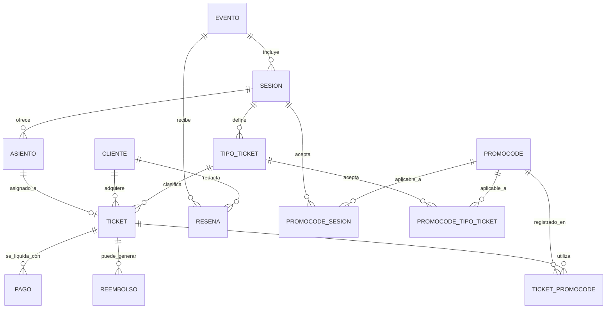

## Plataforma de Eventos y Entradas (Eventos → Sesiones → Tickets)

1. El sistema gestiona **Eventos** (con nombre, descripción, lugar, fechas).
2. Un Evento puede tener **múltiples Sesiones** (fechas/horas distintas en mismo evento).
3. Cada Sesión tiene **Tipos de Ticket** (General, VIP, Early-bird) con precio y cantidad limitada por tipo.
4. **Asiento opcional**: algunas sesiones son numeradas (asientos), otras son libres (capacidad general).
5. Un **Cliente** compra uno o varios **Tickets** para una sesión — cada ticket es único y puede cambiar de estado (reservado, pagado, cancelado, usado).
6. Soportar **descuentos/promocodes** aplicables a sesiones específicas o tipo de ticket.
7. Registrar **Check-in** cuando el asistente usa el ticket; no se puede volver a usar.
8. Posibilidad de **reembolso parcial** con reglas (plazo para devolución, comisión).
9. **Reseñas** del evento por asistentes después de la sesión.
10. Necesidad de reportes: ocupación por sesión, ingresos por evento, tickets vendidos por tipo.

# Sistema de Administración de Eventos y Entradas

_(Modelo conceptual: Eventos → Sesiones → Tickets)_

---

## 1. Requisitos Funcionales

1. La plataforma permite gestionar **Eventos**, almacenando datos como título, descripción, ubicación y fechas de inicio y finalización.
2. Cada **Evento** puede incluir varias **Sesiones**, con horarios y fechas propias.
3. Dentro de una **Sesión** se configuran diferentes **Categorías de Tickets** (ejemplo: General, VIP, Early Bird), cada una con precio y cupo limitados.
4. El sistema admite tanto **sesiones con butacas numeradas** (entidad **Asiento**) como **entradas generales sin numeración**.
5. Los **Usuarios** pueden adquirir uno o más **Tickets** individuales, cada uno identificado de forma única (QR o código) y con estados posibles: reservado → pagado → usado / cancelado.
6. Se registran los **Pagos**, con soporte para abonos totales o parciales (por cuotas o fracciones).
7. Es posible aplicar **Códigos Promocionales** que otorgan descuentos, ya sea sobre sesiones específicas o categorías de ticket.
8. Se contemplan **Devoluciones** (totales o parciales) bajo ciertas condiciones: plazos, comisiones y estado de autorización.
9. Los asistentes pueden dejar **Opiniones o Reseñas** del evento, validadas a través del check-in.
10. El sistema debe generar **Informes**: ocupación de sesiones, ventas por tipo de ticket, ingresos totales, etc.

---

## 2. Entidades Principales

- **Evento**
- **Sesion**
- **TipoTicket**
- **Ticket**
- **Cliente**
- **Asiento**
- **Promocode**
- **Pago**
- **Reembolso**
- **Resena**

---

## 3. Relaciones y Cardinalidades

- Un **Evento (1)** está compuesto por **(1..N) Sesiones**.
- Una **Sesion (1)** define **(1..N) Categorías de Ticket**.
- Una **Sesion (1)** puede vender **(0..N) Tickets**.
- Un **TipoTicket (1)** clasifica **(0..N) Tickets**.
- Un **Cliente (1)** posee **(0..N) Tickets**.
- Una **Sesion (1)** puede tener **(0..N) Asientos** (si es con numeración).
- Un **Asiento (1)** se asigna como máximo a **(1) Ticket**.
- Un **Promocode (1)** puede vincularse a **(0..N) Sesiones** y a **(0..N) Tipos de Ticket**.
- Un **Ticket (0..N)** puede utilizar **(0..N) Promocodes** (relación **N:M**).
- Un **Ticket (1)** requiere **(1..N) Pagos**.
- Un **Ticket (1)** puede generar **(0..N) Reembolsos**.
- Un **Cliente (1)** puede emitir **(0..N) Reseñas**.
- Un **Evento (1)** recibe **(0..N) Reseñas**.

---

## 4. Atributos por Entidad

**Evento**

- evento_id
- nombre
- descripcion
- lugar
- fecha_inicio
- fecha_fin

**Sesion**

- sesion_id
- evento_id
- fecha_hora_inicio
- fecha_hora_fin
- capacidad_general
- estado
- es_numerada

**TipoTicket**

- tipo_ticket_id
- sesion_id
- nombre_tipo
- precio
- cupo
- vendidos

**Ticket**

- ticket_id
- tipo_ticket_id
- cliente_id
- asiento_id (nullable)
- codigo_unico
- estado
- fecha_compra
- importe_pagado
- fecha_checkin

**Cliente**

- cliente_id
- nombre
- email
- telefono
- fecha_registro

**Asiento**

- asiento_id
- sesion_id
- seccion
- fila
- numero
- accesibilidad

**Promocode**

- promocode_id
- codigo_unico
- tipo_descuento (porcentaje / valor fijo)
- valor
- fecha_inicio
- fecha_fin
- limite_uso
- veces_usado
- activo

**Pago**

- pago_id
- ticket_id
- importe
- fecha_pago
- metodo_pago
- referencia
- estado

**Reembolso**

- reembolso_id
- ticket_id
- monto
- fecha_solicitud
- fecha_aprobacion
- comision
- estado

**Resena**

- resena_id
- cliente_id
- evento_id
- calificacion
- comentario
- fecha

---

## 5. Jerarquías y Generalizaciones

- **Ticket** puede especializarse en subtipos de acuerdo con el **Tipo de Ticket** (VIP, General, Early Bird, etc.).
- **Cliente** puede ampliarse a una entidad más genérica como **Usuario**, con distintos roles: Cliente, Organizador o Administrador.
- **Sesion** incluye la posibilidad de asociar **Asientos** cuando `es_numerada = true`.
- **Promocode** puede dividirse en variantes aplicables a **Sesiones** o a **Tipos de Ticket**.

---

## 6. Diagrama Entidad-Relación (Chen / Mermaid)

