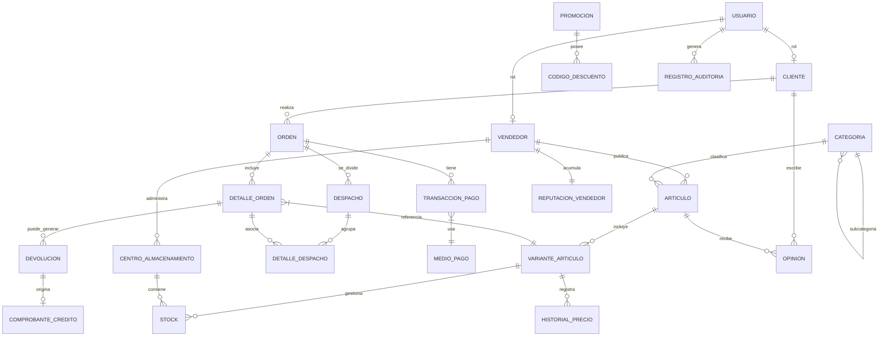

## Marketplace + Logística (ventas, proveedores, stock, envíos, devoluciones, promociones)

1. La plataforma es un **marketplace** donde **Vendedores** ponen a la venta **Productos** y **Clientes** compran.
2. Un **Usuario** puede ser ​**Cliente**​, **Vendedor** o ambos (modelo con subtipos).
3. Los **Productos** tienen **variantes** (p. ej. talla, color) y pertenecen a una **Categoría** jerárquica (categoría → subcategoría → …).
4. Cada **Producto/Variante** mantiene **inventario** por **Almacén** (multi-warehouse).
5. Los **Vendedores** pueden tener **múltiples almacenes** u ofrecer “dropshipping” (stock en proveedor).
6. Un **Pedido** es creado por un Cliente y puede contener múltiples **Líneas de pedido (order items)** (cada item apunta a una variante de producto).
7. Un **Pedido** puede dividirse en ​**varios envíos (Shipments)**​; un envío agrupa uno o varios items y tiene ​**estado de envío**​.
8. El sistema registra **Pagos** (posibles múltiples intentos, reembolsos parciales) y ​**Método de pago**​.
9. Existencia de ​**Devoluciones**​: se registra devolución por línea, motivo, estado y posible **nota de crédito** o reembolso.
10. **Promociones / Cupones** aplicables por producto, categoría, vendedor o pedido (fechas de validez, condiciones mínimas).
11. **Reseñas** y **Valoraciones** de producto por clientes, y ​**reputación de vendedor**​.
12. **Historial de precios** (price history) para cada variante — interesa para auditoría y análisis.
13. **Reglas de negocio** importantes: reserva de stock cuando se crea pedido; cancelación en ventana X minutos; bloqueo de envío si stock insuficiente; máximos de compra por cliente por producto (ej.: 5 unidades).
14. Registro de ​**logs de auditoría**​: quién creó/actualizó pedidos, cambios de stock críticos.
15. **Reportes** frecuentes: ventas por día/region/vendedor, productos sin stock, pedidos pendientes de pago.

# Sistema de Marketplace con Gestión Logística

## 1. Descripción General

1. El sistema corresponde a un **marketplace digital** en el que **proveedores externos** publican sus productos y los **clientes** los adquieren.
2. Los **usuarios** pueden asumir el rol de **compradores**, **vendedores** o ambos mediante un modelo jerárquico de roles.
3. Los **productos** se organizan en **categorías jerárquicas** y disponen de **variantes** (ejemplo: talla, color, presentación).
4. Cada **variante** mantiene inventario en uno o varios **centros de almacenamiento**.
5. Los **vendedores** gestionan sus propios depósitos o trabajan con modelos de **dropshipping**.
6. Los **pedidos** de los clientes incluyen múltiples **líneas de productos** que hacen referencia a variantes específicas.
7. Un **pedido** puede dividirse en varios **despachos**, cada uno con su estado logístico independiente.
8. El sistema admite **pagos con distintos métodos**, con posibilidad de múltiples intentos y **reembolsos parciales**.
9. Las **devoluciones** se procesan a nivel de línea de pedido, generando una **nota de crédito** cuando corresponde.
10. Se implementan **promociones y cupones de descuento** aplicables por producto, categoría, vendedor o pedido.
11. Los clientes pueden publicar **reseñas**, y los vendedores mantienen una **reputación calculada**.
12. Cada variante conserva un **historial de precios** con vigencia temporal.
13. **Reglas de negocio**: bloqueo de inventario al crear pedidos, cancelación bajo condiciones de tiempo, límites de compra por cliente.
14. Se registran **logs de auditoría** en cambios de pedidos e inventario.
15. El sistema genera **reportes** de ventas, existencias y entregas pendientes.

---

## 2. Requisitos Funcionales

1. Plataforma con **roles diferenciados** (cliente, vendedor).
2. **Usuarios** estructurados en superclase y subtipos.
3. **Artículos** con variantes y categorías jerárquicas.
4. **Inventario multi-depósito** enlazado a variantes.
5. Soporte de **almacenes propios y dropshipping**.
6. **Pedidos** con múltiples líneas asociadas a variantes.
7. **Despachos** que agrupan ítems de un pedido.
8. **Pagos** con distintos métodos y soporte de reintentos.
9. **Devoluciones** con nota de crédito vinculada.
10. **Promociones y cupones** aplicados a varios niveles.
11. **Opiniones de clientes** y **reputación de vendedores**.
12. **Historial de precios** para auditoría.
13. Validaciones de **reglas de negocio** de stock y compra.
14. **Registros de auditoría** para cambios sensibles.
15. **Reportes ejecutivos** de ventas e inventarios.

---

## 3. Entidades Identificadas

- **Usuario**
- **Cliente**
- **Vendedor**
- **Articulo**
- **VarianteArticulo**
- **Categoria**
- **CentroAlmacenamiento**
- **Stock**
- **Orden**
- **DetalleOrden**
- **Despacho**
- **DetalleDespacho**
- **TransaccionPago**
- **MedioPago**
- **Devolucion**
- **ComprobanteCredito**
- **Promocion**
- **CodigoDescuento**
- **Opinion**
- **ReputacionVendedor**
- **HistorialPrecio**
- **RegistroAuditoria**

---

## 4. Relaciones y Cardinalidades

- Un **Usuario** puede ser **Cliente** y/o **Vendedor** (herencia).
- Un **Vendedor** gestiona múltiples **Artículos**.
- Un **Artículo** tiene varias **Variantes**.
- Una **Categoría** puede tener subcategorías (auto-relación).
- Cada **Artículo** pertenece a una **Categoría**.
- Un **Vendedor** administra uno o varios **Almacenes**.
- Cada **Variante** registra inventario en distintos almacenes.
- Un **Cliente** genera múltiples **Órdenes**.
- Una **Orden** contiene varias **Líneas de pedido**.
- Cada **Línea** corresponde a una **Variante**.
- Una **Orden** puede dividirse en varios **Despachos**.
- Un **Despacho** agrupa varios ítems de pedido.
- Una **Orden** puede tener múltiples **Pagos**.
- Un **Pago** se vincula a un **Medio de pago**.
- Una **Línea de pedido** puede generar **Devoluciones**.
- Una **Devolución** puede derivar en un **Comprobante de crédito**.
- Una **Promoción** puede aplicarse a productos, categorías o pedidos.
- Un **Cliente** emite reseñas sobre artículos.
- Un **Vendedor** tiene una **Reputación** asociada.
- Una **Variante** guarda su **Historial de precios**.
- Los **Usuarios** generan **Logs de auditoría**.

---

## 5. Atributos Principales

**Usuario**

- id_usuario, correo, clave, nombre, telefono, fecha_registro, estado, tipo

**Cliente**

- id_cliente, id_usuario, direccion, fecha_nacimiento, genero, limite_credito

**Vendedor**

- id_vendedor, id_usuario, razon_social, estado_verificacion, fecha_verificacion, comision

**Articulo**

- id_articulo, id_vendedor, id_categoria, nombre, descripcion, marca, modelo, fecha_alta

**VarianteArticulo**

- id_variante, id_articulo, sku, descripcion_variante, precio_base, precio_oferta, talla, color, peso, dimensiones

**Categoria**

- id_categoria, id_categoria_padre, nombre, descripcion, nivel

**CentroAlmacenamiento**

- id_almacen, id_vendedor, direccion, tipo, capacidad

**Stock**

- id_stock, id_variante, id_almacen, disponible, reservado, minimo, ubicacion

**Orden**

- id_orden, id_cliente, numero_orden, fecha, estado, subtotal, descuentos, impuestos, total, direccion_envio

**DetalleOrden**

- id_detalle, id_orden, id_variante, cantidad, precio_unitario, subtotal, estado

**Despacho**

- id_despacho, id_orden, tracking, transportadora, estado, fecha_envio, fecha_entrega_estimada, fecha_entrega_real, costo

**DetalleDespacho**

- id_detalle_despacho, id_despacho, id_detalle_orden, cantidad

**TransaccionPago**

- id_pago, id_orden, id_medio_pago, monto, fecha, estado, referencia, intento

**MedioPago**

- id_medio, nombre, descripcion, activo

**Devolucion**

- id_devolucion, id_detalle_orden, cantidad, motivo, estado, fecha_solicitud, fecha_aprobacion

**ComprobanteCredito**

- id_comprobante, id_devolucion, monto, fecha_emision, estado

**Promocion**

- id_promocion, nombre, descripcion, tipo_descuento, valor, fecha_inicio, fecha_fin, minimo_compra, limite_uso, activo

**CodigoDescuento**

- id_codigo, id_promocion, codigo, usos_actuales, activo

**Opinion**

- id_opinion, id_cliente, id_articulo, calificacion, comentario, fecha, verificada

**ReputacionVendedor**

- id_reputacion, id_vendedor, promedio, total_opiniones, ventas_finalizadas

**HistorialPrecio**

- id_historial, id_variante, precio_anterior, precio_nuevo, fecha_cambio, motivo

**RegistroAuditoria**

- id_log, tabla, registro, accion, usuario, valores_previos, valores_nuevos, fecha

---

## 6. Jerarquías

- **Usuario** como clase general, con subtipos **Cliente** y **Vendedor**.
- **Categoría** con auto-relación para formar jerarquía de productos.
- **Centro de almacenamiento** con variantes: propio o dropshipping.
- **Pago** especializado en métodos (tarjeta, transferencia, etc.).
- **Promoción** diferenciada según su aplicación (producto, categoría, pedido).

---

## 7. Diagrama Entidad-Relación (Chen en Mermaid)

